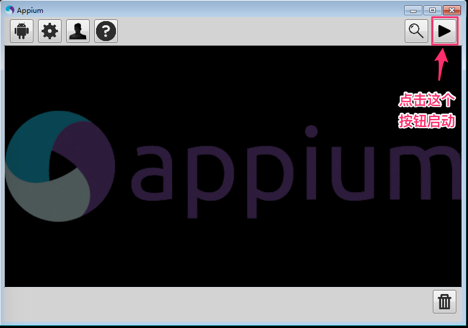
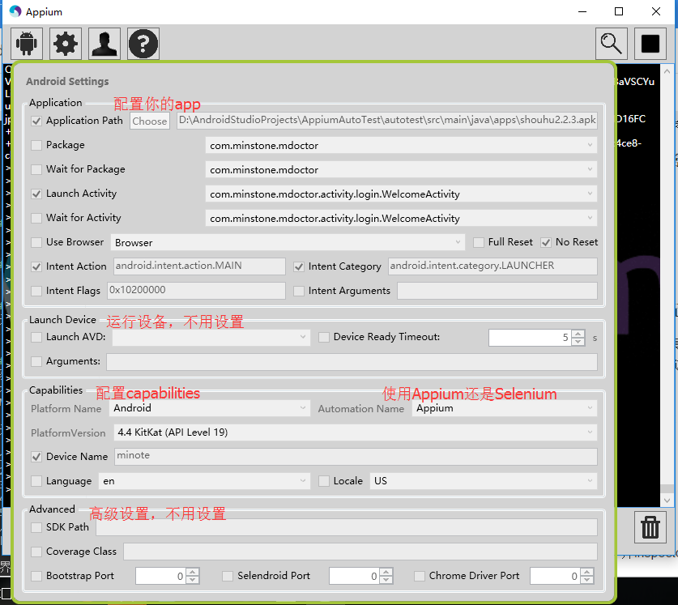
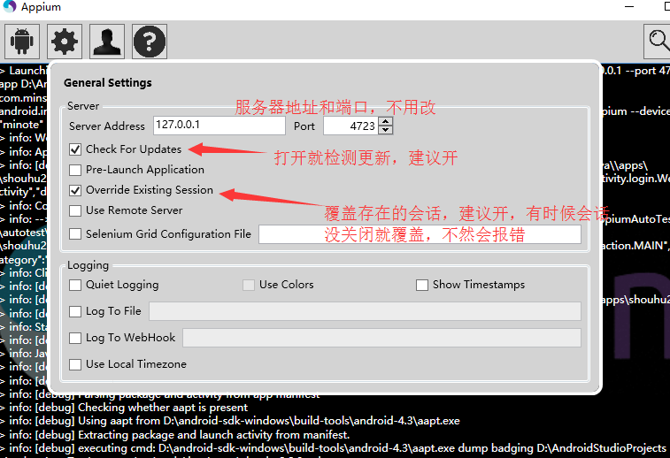
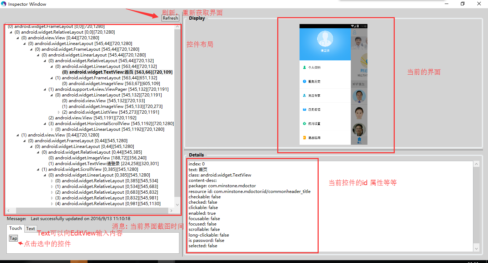
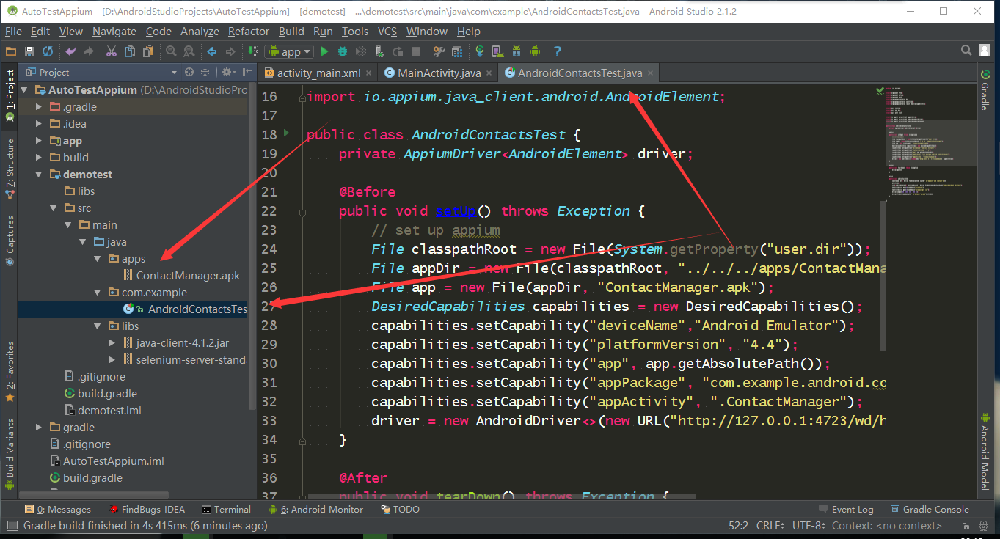
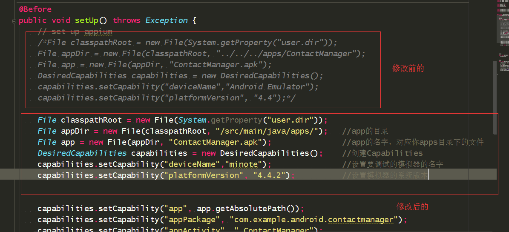

#### Appium
---
#### 1. Appium 介绍
Appium 是一个自动化测试开源工具，支持 iOS 平台和 Android 平台上的原生应用，web 应用和混合应用。
支持平台：iOS、Android、Windows、FirefoxOS
具体详见[官方文档][9]

#### 2. Appium 的理念
为了满足移动自动化需求，Appium 遵循着一种哲学，主要有以下4条：
1. 你无需为了自动化，而重新编译或者修改你的应用。
2. 你不必局限于某种语言或者框架来写和运行测试脚本。
3. 一个移动自动化的框架不应该在接口上重复造轮子。（移动自动化的接口应该统一）
4. 无论是精神上，还是名义上，都必须开源。

#### 3. Appium搭建和安装（Android）
1. [安装JDK并设置环境变量](#1)
2. [安装Android SDK并设置环境变量](#2)
3. [安装Nodejs](#3)
4. [安装appium](#4)
5. [验证安装](#5)

<h5 id="1">安装JDK并设置环境变量(以windows为例)</h5>

1. 到Java官网下载相应的JDK并安装
2. 设置环境变量

     i.  添加JAVA_HOME对应的路径 
     `C:\Program Files\Java\jdk1.7.0_79`
    ii.  在PATH变量末尾追加 
    `;%JAVA_HOME%/bin;`
   iii. 添加CLASSPATH，设置值为
   `%JAVA_HOME%\lib;%JAVA_HOME%\lib\tools.jar`
3. 在command line 输入`java -version`
显示如下内容说明配置正确

```
java version "1.7.0_79"<br>
Java(TM) SE Runtime Environment (build 1.7.0_79-b15)<br>
Java HotSpot(TM) 64-Bit Server VM (build 24.79-b02, mixed mode)
```

<h5 id="2">安装Android SDK并设置环境变量</h5>

>注意：安装Android SDK需要翻墙并更新你的SDK repository

1. 到[Android 官网][1]下载并安装SDK
2. 设置环境变量

     i.  添加ANDROID_HOME设置值为：
     `C:\(你的安装路径)\Android\sdk`
    ii. 在path环境变量值末尾追加：
    `;%ANDROID_HOME%\tools;%ANDROID_HOME%\platform-tools;`
3. 设置完毕后在命令行输入`adb devices`
结果如下，说明配置成功：

```
* daemon not running. starting it now on port 5037 *
* daemon started successfully *
```


<h5 id="3">安装Nodejs</h5>

1. 到[Nodejs官网][2]下载最新版本的NodeJs并直接安装。
2. 安装完毕后，打开命令行，输入`node -v`
出现类似下面的信息说明安装成功

```
 v4.0.0
```

<h5 id="4">安装appium</h5>

安装appium有两种方式：
>npm 安装在 windows 相对比较复杂，建议使用官方安装包。

1. 使用 **npm**安装**Appium**
  ```
npm install -g appium 
```
2. 使用**Appium**官方安装包安装
到[Appium官网][3]下载和你所使用系统一致的版本进行安装

<h5 id="5">验证安装</h5>

当确认Appium安装完毕后，我们可以通过`appium-doctor`的命令来检查当前appium安装是否完善，当前的JDK、SDK等环境是否配置正确。
如果`appium-doctor`返回的内容是有错的，请根据返回的具体的提示，将你的环境搭建完善。
如果返回的结果类似如下，说明安装成功

```  
Android Checks were successful.
All Checks were successful
```
>需要注意的是，如果你是通过安装包安装的，使用appium-doctor 命令时必须切换到 C:\Program Files (x86)\Appium\node_modules\.bin 目录

#### 4.启动 Appium Server
1. 从命令行启动

    ```
$ appium
info: Welcome to Appium v1.4.16 (REV ae6877eff263066b26328d457bd285c0cc62430d)
info: Appium REST http interface listener started on 0.0.0.0:4723
info: Console LogLevel: debug

```

2. 通过图形化界面安装的 appium


#### 5.appium界面简介
1. Android Setting 
在这里设置主要为了不用在脚本里面添加capabilities属性和inspector检测使用。 


2. General Setting
这里服务器是本机，端口是4723，这是appium的端口，不是模拟器的端口。 


3. inspector 
放大镜工具，获取app界面控件属性的工具。


4. 日志输出
中间黑色背景，是显示日志的
     i. info：Appium的调试信息 
     ii. error：错误信息
     
#### 6.编写测试脚本（[官方demo][8]）
1. AndroidStudio中新建android工程。
2. 创建java module命名appium，此java工程用来开发自动化case。
3. 下载[ Appium java client ][4]及[Selenium Java standalone server][5]两个库对应的jar包
4. 添加jar包
5. 创建文件夹命名apps，添加待测试的APK ([官方测试APK][6])
6. 创建类初始化配置(这里使用[官方测试源码][7])


    >注意：这里的系统名和路径要改成自己的
   
#### 7. 运行
     i.开启appium
    ii.在当前脚本编辑器右键选择`Run AndroidContactsTest`。 

[1]:https://developer.android.com/studio/index.html#Other
[2]:https://nodejs.org/en/
[3]:https://bitbucket.org/appium/appium.app/downloads/
[4]:https://search.maven.org/#search%7Cga%7C1%7Cg%3Aio.appium%20a%3Ajava-client
[5]:http://www.seleniumhq.org/download/
[6]:https://github.com/appium/sample-code/blob/master/sample-code/apps/ContactManager/ContactManager.apk 
[7]:https://github.com/appium/sample-code/blob/master/sample-code/examples/java/junit/src/test/java/com/saucelabs/appium/AndroidContactsTest.java 
[8]:https://github.com/appium/sample-code/tree/master/sample-code/examples
[9]:http://appium.io/documentation.html?lang=zh


