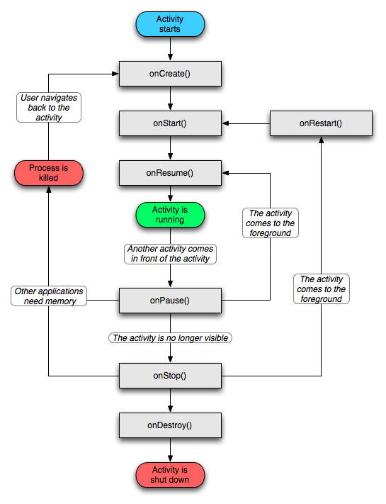
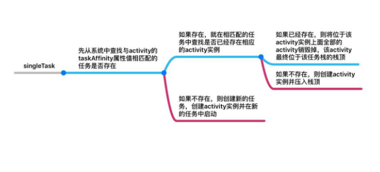

## 四大组件
#### Activity


Activity生命周期方法主要有onCreate()、onStart()、onResume()、onPause()、onStop()、onDestroy()和onRestart()等7个方法。

1. 启动一个A Activity，分别执行onCreate()、onStart()、onResume()方法。
2. 从A Activity打开B Activity分别执行A onPause()、B onCreate()、B onStart()、B onResume()、A onStop()方法。
3. 关闭B Activity，分别执行B onPause()、A onRestart()、A onStart()、A onResume()、B onStop()、B onDestroy()方法。
4. 横竖屏切换A Activity，清单文件中不设置android:configChanges属性时，先销毁onPause()、onStop()、onDestroy()再重新创建onCreate()、onStart()、onResume()方法，设置orientation|screenSize（一定要同时出现）属性值时，不走生命周期方法，只会执行onConfigurationChanged()方法。
5. Activity之间的切换可以看出onPause()、onStop()这两个方法比较特殊，切换的时候onPause()方法不要加入太多耗时操作否则会影响体验。

###### activity的启动模式

1. task 一组相互有关联的 activity 集合（可以理解为 Activity 是在 task 里面活动的）。task 存在于一个称为 `back stack`的数据结构中，也就是说， task 是以栈的形式去管理 activity 的，所以也叫可以称为“任务栈”。
2. taskAffinity ("The task that the activity has an affinity for.)翻译为 activity 相关或者亲和的任务，这个参数标识了一个 Activity 所需要的任务栈的名字。
默认情况下，所有Activity所需的任务栈的名字为应用的包名。 taskAffinity 属性主要和 singleTask 启动模式或者 allowTaskReparenting 属性配对使用。

4种启动模式

1. standard：标准模式，也是系统默认的启动模式。
假如activity A 启动了 activity B， activity B 则会运行在activity A 所在的任务栈中。而且每次启动一个 Activity ，都会重新创建新的实例，不管这个实例在任务中是否已经存在。
>非 Activity 类型的 context （ApplicationContext ）启动 standard 模式的 Activity 时会报错。
原因：非 Activity 类型的 context 并没有所谓的任务栈
解决：为待启动 Activity 指定 `FLAG_ACTIVITY_NEW_TASK `标记位，这样启动的时候系统就会为它创建一个新的任务栈。这个时候待启动 Activity !
其实是以 singleTask 模式启动的。
2. singleTop：栈顶复用模式。
假如 activity A 启动了 activity B ，就会判断 A 所在的任务栈栈顶是否是 B 的实例。
如果是，则不创建新的 activity B 实例而是直接引用这个栈顶实例，同时 `onNewIntent ()`方法会被回调，通过该方法的参数可以取得当前请求的信息。
如果不是，则创建新的 activity B 实例。
3. singleTask：栈内复用模式。
在第一次启动这个 Activity 时，系统便会创建一个新的任务，并且初始化 Activity 的实例，放在新任务的底部。需要设置 taskAffinity 属性。taskAffinity 属性是和 singleTask 模式搭配使用的。



4. singleInstance：单实例模式。
这个是 singleTask 模式的加强版，它除了具有 singleTask 模式的所有特性外，它还有一点独特的特性，那就是此模式的 Activity 只能单独地位于一个任务栈，不与其他 Activity 共存于同一个任务栈。

###### 让Activity变成一个窗口
设置activity的style属性=”@android:style/Theme.Dialog”
 
###### 结束activity
```java
Finish()
killProgress()
System.exit(0)
```
关闭应用程序时，结束所有的activity
可以创建一个List集合，每新创建一个activity，将该activity的实例放进list中，程序结束时，从集合中取出循环取出activity实例，调用finish()方法结束。

###### 保存activity的状态
当activity处于onPause，onStop之后，activity处于未活动状态，但是activity对象却仍然存在。

i. 当内存不足，onPause，onStop之后的activity可能会被系统摧毁。

ii.在onPuase方法中调用onSavedInstanceState()。
onSavedInstanceState()需要Bundle类型的参数，我们可以将数据保存到bundle中，通过实参传递给onSavedInstanceState方法()。

iii. Activity被销毁后，重新启动时，在onCreate方法中，接受保存的bundle参数，并将之前的数据取出。

###### activity、context、application

i. content与application都继承与contextWrapper，contextWrapper继承于context类。

ii. context表示当前上下文对象，保存的是上下文中的参数和变量，它可以让更加方便访问到一些资源。

iii. context通常与activity的生命周期是一样的，application表示整个应用程序的对象。对于一些生命周期较长的，不要使用context，可以使用application。

iv. 在activity中，尽量使用静态内部类，不要使用内部类。内部里作为外部类的成员存在，不是独立于activity，如果内存中还有内存继续引用到context，activity如果被销毁，context还不会结束。

###### 横竖屏切换时候 activity 的生命周期
设置Activity的`android:configChanges`时,切屏会重新调用各个生命周期,切横屏时会执行一次,切竖屏时会执行两次.
设置Activity的`android:configChanges=”orientation”`时,切屏还是会重新调用各个生命周期,切横、竖屏时只会执行一次.
设置Activity的`android:configChanges=”orientation|keyboardHidden”`时,切屏不会重新调用各个生命周期,只会执行onConfigurationChanged方法.

#### Fragment

  


###### Fragment与Activity生命周期对比


Fragment的生命周期方法主要有onAttach()、onCreate()、onCreateView()、onActivityCreated()、onstart()、onResume()、onPause()、onStop()、onDestroyView()、onDestroy()、onDetach()等11个方法。

1. 切换到该Fragment，分别执行onAttach()、onCreate()、onCreateView()、onActivityCreated()、onstart()、onResume()方法。
2. 锁屏，分别执行onPause()、onStop()方法。
3. 亮屏，分别执行onstart()、onResume()方法。
4. 覆盖，切换到其他Fragment，分别执行onPause()、onStop()、onDestroyView()方法。
5. 从其他Fragment回到之前Fragment，分别执行onCreateView()、onActivityCreated()、onstart()、onResume()方法。

###### Fragment的使用

1. 静态使用
所谓静态使用指的就是将自定义的Fragment写到xml布局文件中，利用`<fragment></fragment>`标签定义Fragment 。
有三种方法为Fragment提供ID：
```java
　　android:id   #唯一的id
　　android:tag  #唯一的字符串
　　如果上面两个都没提供，系统使用容器view的ID。
```

2. 动态使用
动态使用Fragment就是手动在代码中添加、更新、删除Fragment。获取FragmentManager，addFragment，设置默认显示Fragment，开启事务transaction，提交事务。

###### Fragment与activity如何传值
Fragment对象有一个getActivity的方法，通过该方法与activity交互。
使用framentmentManager.findFragmentByXX可以获取fragment对象，在activity中直接操作fragment对象

###### FragmentTransaction 
1. 显示：`add()` `replace()` `show()` `attach()`
2. 隐藏：`remove()` `hide()` `detach()`
>相对add()方法执行onAttach()-onResume()的生命周期, remove()就是完成的onPause()-onDetach()周期。

###### FragmentTransaction 的replace和add的方法区别

在Fragment数量大于等于2的时候，调用add()还是replace()的区别才能体现出来。

1. add 是把一个fragment添加到一个容器 container 里。
当通过add()连续两次添加Fragment的时候，每个Fragment生命周期中的onAttach()-onResume()都会被各调用一次，而且两个Fragment的View会被同时attach到containerView。
同样，退出Activty时，每个Fragment生命周期中的onPause()-onDetach()也会被各调用一次。
2. replace 是先remove掉相同id的所有fragment，然后在add当前的这个fragment。
当使用replace()来添加Fragment的时候，第二次添加会导致第一个Fragment被销毁，即执行第二个Fragment的onAttach()方法之前会先执行第一个Fragment的onPause()-onDetach()方法，同时containerView会detach第一个Fragment的View。

###### show() & hide()和attach() & detach()的区别
1. show() & hide()方法时，Fragment的生命周期方法并不会被执行，仅仅是Fragment的View被显示或者​隐藏。
尽管Fragment的View被隐藏，但它在父布局中并未被detach，仍然是作为containerView的childView存在着。
2. attach() & detach()做的就更彻底一些。一旦一个Fragment被detach()，它的onPause()-onDestroyView()周期都会被执行。

###### Fragment实现压栈和出栈
Fragment 的事物管理器内部维持了一个`双向链表结构`，该结构可以记录我们每次 add 的Fragment 和 replace 的 Fragment，然后当我们点击 back 按钮的时候会自动帮我们实现退栈操作。

###### 避免Fragment重新实例化
`replace()`实现是当前Fragment不再需要时，采用的方法。
解决
添加时add()，切换时 hide()。
add()添加Fragment，当切换页面时，只需 hide()当前Fragment，show()另一个Fragment即可。

#### service
Service运行在主线程。
Android的后台指，运行完全不依赖UI，即使Activity被销毁，或者程序被关闭，只要进程还在，Service就可以继续运行。

###### 生命周期
手动调用方法
```java
1. startService()        #启动服务
2. stopService()         #关闭服务
3. bindService()         #绑定服务
4. unbindService()       #解绑服务
```
内部自动调用的方法
```java
1. oncreat()                #创建服务
2. onstartCommand()         #开始服务
3. onDestroy()              #销毁服务
4. onBind()                 #绑定服务
5. onUnbind()               #解绑服务
```
1. 手动调用`startService()`启动服务自动调用内部方法：onCreate()、onStartCommand()，如果一个   	                service被startService()多次启动，那么onCreate()也只会调用一次。
2. 手动调用`stopService()`关闭服务，自动调用内部方法：onDestory()，如果一个Service被启动且被绑定, 如果在没有解绑的前提下使用stopService()关闭服务是无法停止服务的。
3. 手动调用`bindService()`后，自动调用内部方法：onCreate()、onBind()。
4. 手动调用`unbindService()`后，自动调用内部方法：onUnbind()、onDestory()。
5. `startService()`和`stopService()`只能开启和关闭Service，无法操作Service，调用者退出后Service仍然存在；bindService()和unbindService()可以操作Service，调用者退出后，Service随着调用者销毁。

```java
public class MyService extends Service {  
    @Override  
    public void onCreate() {  
        super.onCreate();  
    }  
      /**
     * 当每次使用 startService 调用服务时，调用该方法（但一个服务同时只会存在一个实例）
     * 通过 Intent 传递的数据，也会在这里得到
     * 注意和 onCreate() 方法的区别：
     *      onCreate() 一个应用开启服务时，该方法只会调用一次
     *      onStartCommand() 只要使用 startService() 调用此服务，该方法就会执行一次
     */
    @Override  
    public int onStartCommand(Intent intent, int flags, int startId) {  
    // 可以执行网络操作 但是在主线程运行时最好不要进行网络请求这类耗时的工作
        return super.onStartCommand(intent, flags, startId);  
    }  
    @Override  
    public void onDestroy() {  
        super.onDestroy();  
    }  
      // Android 官方提供的 Binder 对象，不过为了实现 Service 和 Activity 互相通信，之后我们要自己重新实现一个类
    @Override  
    public IBinder onBind(Intent intent) {  
        return null;  
    }  
 class MyBinder extends Binder {  
  
        public void startDownload() {  
            Log.d("TAG", "startDownload() executed");  
            // 执行具体的下载任务  
        }  
  
    }  
}  
```
启动Service需要借助Intent来实现
```java
  @Override  
    public void onClick(View v) {  
        switch (v.getId()) {  
        case R.id.start_service:  
            Intent startIntent = new Intent(this, MyService.class);  
            startService(startIntent);  
            break;  
        case R.id.stop_service:  
            Intent stopIntent = new Intent(this, MyService.class);  
            stopService(stopIntent);  
            break;  
        default:  
            break;  
        }  
    }  
```
service必须在AndroidManifest.xml中注册
```java
<?xml version="1.0" encoding="utf-8"?>  
<manifest xmlns:android="http://schemas.android.com/apk/res/android"  
    package="com.example.servicetest"  
    android:versionCode="1"  
    android:versionName="1.0" >  
    
    <uses-sdk  
        android:minSdkVersion="14"  
        android:targetSdkVersion="17" />  
  
    <application  
        android:allowBackup="true"  
        android:icon="@drawable/ic_launcher"  
        android:label="@string/app_name"  
        android:theme="@style/AppTheme" >  
    … 
        <service android:name="com.example.servicetest.MyService" >  
        </service>  
    </application>  
  
</manifest>  
```
###### Service和Activity通信
>Activity中指定让Service去执行什么任务
onBind()方法是用于和Activity建立关联

1. 新增了一个MyBinder类继承自Binder类，然后在MyBinder中添加了一个startDownload()方法用于在后台执行下载任务。
2. 创建了一个`ServiceConnection`的类，在里面重写了`onServiceConnected()`方法和`onServiceDisconnected()`方法，这两个方法分别会在Activity与Service建立关联和解除关联的时候调用。

```java
   private ServiceConnection connection = new ServiceConnection() {  
        @Override  
        public void onServiceDisconnected(ComponentName name) { }  
        @Override  
        public void onServiceConnected(ComponentName name, IBinder service) {  
            myBinder = (MyService.MyBinder) service;  
            myBinder.startDownload();  
        }  
    }; 
```
3. 调用`bindService()`方法将Activity和Service进行绑定。
bindService()方法接收三个参数，第一个参数是的Intent对象，第二个参数是ServiceConnection的实例，第三个参数是一个标志位，这里传入`BIND_AUTO_CREATE`。
表示在Activity和Service建立关联后自动创建Service，这会使得MyService中的onCreate()方法得到执行，但onStartCommand()方法不会执行。

```java
Intent bindIntent = new Intent(this, MyService.class);  
bindService(bindIntent, connection, BIND_AUTO_CREATE); 
```
###### activity，service，intent之间的关系
都是android应用频率非常的组件。

1. Activity与service是四大核心组件。Activity用来加载布局，显示窗口界面。
2. service运行后台，没有界面显示。
3. intent是activity与service的通信使者。
4. 默认情况下service与activity在同一个线程，都在main Thread线程中。
5. 如果在清单文件中指定service的process属性，那么service就在另一个进程中运行。

###### Service和Thread
```java
public int onStartCommand(Intent intent, int flags, int startId) {  
    new Thread(new Runnable() {  
        @Override  
        public void run() {  
            // 开始执行后台任务  
        }  
    }).start();  
    return super.onStartCommand(intent, flags, startId);  
}  
class MyBinder extends Binder {  
    public void startDownload() {  
        new Thread(new Runnable() {  
            @Override  
            public void run() {  
                // 执行具体的下载任务  
            }  
        }).start();  
    }  
  
```
###### 前台Service
状态栏显示
```java
public class MyService extends Service {  
    
    private MyBinder mBinder = new MyBinder();  
  
    @Override  
    public void onCreate() {  
        super.onCreate();  
        Notification notification = new Notification(R.drawable.ic_launcher,  
                "有通知到来", System.currentTimeMillis());  
        Intent notificationIntent = new Intent(this, MainActivity.class);  
        PendingIntent pendingIntent = PendingIntent.getActivity(this, 0, notificationIntent, 0);  
        // 通知初始化布局和数据，并在这里设置了点击通知后就打开MainActivity
        notification.setLatestEventInfo(this, "这是通知的标题", "这是通知的内容", pendingIntent);  
        // 设置成一个前台Service，并会将通知的图片显示出来。
        startForeground(1, notification);  
    }  
  
    ...
  
}  
```
###### IntentService
IntentService 是 Service 的子类
Service 不会专门启动一条单独的进程，Service 与它所在应用位于同一个进程中；
Service 也不是专门一条新线程，因此不应该在 Service 中直接处理耗时的任务；
特征

1. 会创建独立的 worker 线程来处理所有的 Intent 请求。
2. 会创建独立的 worker 线程来处理 onHandleIntent()方法实现的代码，无需处理多线程问题。
3. 所有请求处理完成后，IntentService 会自动停止，无需调用 stopSelf()方法停止 Service。
4. 为 Service 的 onBind()提供默认实现，返回 null。
5. 为 Service 的 onStartCommand 提供默认实现，将请求 Intent 添加到队列中。

使用
让service类继承IntentService，重写onStartCommand和onHandleIntent实现
#### BroadcastReceiver
接受一种或者多种Intent作触发事件，接受相关消息，做一些简单处理，转换成一条Notification，统一了Android的事件广播模型。

###### 广播的接收
```java
public class BroadcastReceiverTest extends BroadcastReceiver {
    @Override
    public void onReceive(Context context, Intent intent) {
        // onReceive 不能做耗时操作,参考值10s
        // onReceive()方法,可以调用 boolean b = isOrderedBroadcast() 判断接收到的广播是否为有序广播。
    }
}
```
>1. 广播接收者的生命周期非常短暂的,在接收到广播的时候创建, onReceive()方法结束之后销毁;
 2. 广播接收者中不要做一些耗时的工作,否则会弹出 Application No Response 错误对话框;
 3. 最好也不要在广播接收者中创建子线程做耗时的工作,因为广播接收者被 销毁后进程就成为了空进程,很容易被系统杀掉;
 4. 耗时的较长的工作最好放在服务中完成;

###### 广播的注册
1. 静态注册
在AndroidManifest.xml中定义，不需程序启动即可接收，可用作自动启动程序 ，当app退出后仍然可以接收到相应的广播。

>1. 3.1后， 系统默认直接增加了值为FLAG_EXCLUDE_STOPPED_PACKAGES的flag，导致即使是静态注册的广播接收器，对于其所在进程已经退出的app，同样无法接收到广播。
2. 通过自定义广播权限来保护自己发出的广播。 在清单文件里receiver必须有这个权限才能收到广播。 需要定义权限，声明权限，这时接收者就能收到发送的广播。
3. 广播的优先级，谁先注册谁优先级高， 并且对无序广播也生效。
4. 对于同一App内部发送和接收广播，将exported属性人为设置成false，使得非本App内部发出的此广播不被接收。
5. 在广播发送和接收时，都增加上相应的permission，用于权限验证。
6. 发送广播时，指定特定广播接收器所在的包名，具体是通过intent.setPackage(packageName)指定，这样此广播将只会发送到此包中的App内与之相匹配的有效广播接收器中。

```java
      //广播接受者
        <receiver android:name=".BroadcastReceiverTest">
            <intent-filter>
                 //广播过滤器 name
                <action android:name="com.xxx.broadCasrReceiver"/>
            </intent-filter>
        </receiver>

```
2. 动态注册
动态广播：只能在代码中注册，程序适应系统变化做操作，程序运行状态才能接收到
```java
//实例化过滤器
IntentFilter intentFilter = new IntentFilter();
//添加过滤的Action值；
intentFilter.addAction("com.xxx.BroadcastReceiver");
//将广播监听器和过滤器注册在一起
registerReceiver(new BroadcastReceiverTest(),intentFilter);

 //销毁Activity时取消注册广播监听器；
  unregisterReceiver(new BroadcastReceiverTest());

Intent intent = new Intent();
intent.setAction("com.xxx.BroadcastReceiver");
sendBroadcast(intent);
```
###### 生命周期
广播接收者的生命周期非常短。当执行onRecieve方法之后，广播就会销毁。
在广播接受者不能进行耗时较长的操作。
在广播接收者不要创建子线程。广播接收者完成操作后，所在进程会变成空进程，很容易被系统回收。

###### 工作流程
......
#### Content Provider
是Android提供的第三方应用数据的访问方案，可以派生Content Provider类，对外提供数据，可以像数据库一样进行选择排序，屏蔽内部数据的存储细节，向外提供统一的接口模型，大大简化上层应用，对数据的整合提 供了更方便的途径。
......
