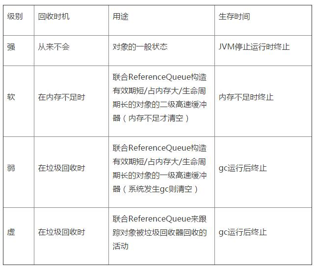

####内存泄露
该被释放的内存没有被释放，一直被某个或某些实例所引用但不能被使用，导致GC不能回收，造成内存泄漏
######常见的内存泄露的场景
1. 单例造成内存泄露
单例模式有其静态的特点，其生命周期和应用一样长，如果单例对象中包含了一个其他对象的引用，那么即使这个对象不再使用，依然存在一个单例对象引用它，造成无法回收。比如：
```javascript
public class AppManager {
    private static AppManager instance;
    private Context context;
    private AppManager(Context context) {
        this.context = context;
    }
    public static AppManager getInstance(Context context) {
        if (instance == null) {
            instance = new AppManager(context);
        }
        return instance;
    }
```
如果传入一个Application Context,它的生命周期和应用一样长，没问题。
如果传入一个Activity Context, Activity退出销毁但任然被单例所引用了，会导致内存泄漏。
```javascript
public class AppManager {
    private static AppManager instance;
    private Context context;
    private AppManager(Context context) {
        this.context = context.getApplicationContext();
    }
    public static AppManager getInstance(Context context) {
        if (instance != null) {
            instance = new AppManager(context);
        }
        return instance;
    }
}
```
2. 非静态内部类创建期静态实例造成内存泄露
在启动频繁的Activity中，为了避免重复创建相同的数据资源，会出现这种写法：
```javascript
public class MainActivity extends AppCompatActivity {
    private static TestResource mResource = null;
    @Override
    protected void onCreate(Bundle savedInstanceState) {
        super.onCreate(savedInstanceState);
        setContentView(R.layout.activity_main);
        if(mResource == null){
            mResource = new TestResource();
        }
        //...
    }
    class TestResource {
        //...
    }
}
```
这样就在Activity内部创建了一个非静态内部类的单例，每次启动Activity时都会使用该单例的数据，这样虽然避免了资源的重复创建，不过这种写法却会造成内存泄漏，因为非静态内部类默认会持有外部类的引用，而又使用了该非静态内部类创建了一个静态的实例，该实例的生命周期和应用的一样长，这就导致了该静态实例一直会持有该Activity的引用，导致Activity的内存资源不能正常回收。正确的做法为：

将该内部类设为静态内部类或将该内部类抽取出来封装成一个单例，如果需要使用Context，请使用Application Context 。
3. 匿名内部类/异步线程造成的内存泄露
```javascript
//——————test1
        new AsyncTask<Void, Void, Void>() {
            @Override
            protected Void doInBackground(Void... params) {
                SystemClock.sleep(10000);
                return null;
            }
        }.execute();
//——————test2
        new Thread(new Runnable() {
            @Override
            public void run() {
                SystemClock.sleep(10000);
            }
        }).start();
```
AsyncTask和Runnable都是一个匿名内部类，因此它们对当前Activity都有一个隐式引用。
如果Activity在销毁之前，任务还未完成， 那么将导致Activity的内存资源无法回收，造成内存泄漏。
正确的做法还是使用静态内部类的方式，如下：
```javascript
static class MyAsyncTask extends AsyncTask<Void, Void, Void> {
        private WeakReference<Context> weakReference;
 
        public MyAsyncTask(Context context) {
            weakReference = new WeakReference<>(context);
        }
 
        @Override
        protected Void doInBackground(Void... params) {
            SystemClock.sleep(10000);
            return null;
        }
 
        @Override
        protected void onPostExecute(Void aVoid) {
            super.onPostExecute(aVoid);
            MainActivity activity = (MainActivity) weakReference.get();
            if (activity != null) {
                //...
            }
        }
    }
    static class MyRunnable implements Runnable{
        @Override
        public void run() {
            SystemClock.sleep(10000);
        }
    }
//——————
    new Thread(new MyRunnable()).start();
    new MyAsyncTask(this).execute();
```
>这样就避免了Activity的内存资源泄漏，当然在Activity销毁时候也应该取消相应的任务AsyncTask::cancel()，避免任务在后台执行浪费资源。
4. handler机制造成内存泄露
```javascript
public class MainActivity extends AppCompatActivity {
    private Handler mHandler = new Handler() {
        @Override
        public void handleMessage(Message msg) {
            //...
        }
    };
    @Override
    protected void onCreate(Bundle savedInstanceState) {
        super.onCreate(savedInstanceState);
        setContentView(R.layout.activity_main);
        loadData();
    }
    private void loadData(){
        //...request
        Message message = Message.obtain();
        mHandler.sendMessage(message);
    }
```
其中mHandler作为一个非静态匿名内部类，持有一个外部类—MainActivity的引用，我们知道对于消息机制是Looper不断的轮询从消息队列取出未处理的消息交给handler处理，而对于这个例子，每一个消息又持有一个mHandler的引用，每一个mHandler又持有MainActivity的引用，所以如果在Activity退出后，消息队列中还存在未处理完的消息，导致该Activity一直被引用，其内存资源无法被回收，导致了内存泄漏。一般我们使用静态内部类和弱引用的写法写Handler。
```javascript
public class MainActivity extends AppCompatActivity {
    private MyHandler mHandler = new MyHandler(this);
    private TextView mTextView ;
    private static class MyHandler extends Handler {
        private WeakReference<Context> reference;
        public MyHandler(Context context) {
            reference = new WeakReference<>(context);
        }
        @Override
        public void handleMessage(Message msg) {
            MainActivity activity = (MainActivity) reference.get();
            if(activity != null){
                activity.mTextView.setText("");
            }
        }
    }
 
    @Override
    protected void onCreate(Bundle savedInstanceState) {
        super.onCreate(savedInstanceState);
        setContentView(R.layout.activity_main);
        mTextView = (TextView)findViewById(R.id.textview);
        loadData();
    }
 
    private void loadData() {
        //...request
        Message message = Message.obtain();
        mHandler.sendMessage(message);
    }
}
```
将Activity的引用声明为弱引用，可以被GC回收。（引用不一定为Context,也可以是Context的子类）
Java对引用的分类有 Strong reference, SoftReference, WeakReference, PhatomReference 四种。

在Android应用的开发中，为了防止内存溢出，在处理一些占用内存大而且声明周期较长的对象时候，可以尽量应用软引用和弱引用技术
5. 资源未回收导致内存泄露
对于使用了BraodcastReceiver，ContentObserver，File，Cursor，Stream，Bitmap等资源的使用，应该在Activity销毁时及时关闭或者注销，否则这些资源将不会被回收，造成内存泄漏(这个可以根据IDE的警告改进一部分)。

######捕捉内存泄露的工具
AS中查看内存泄漏
[参考链接][0]
[0]:http://www.2cto.com/kf/201512/455421.html "参考链接"